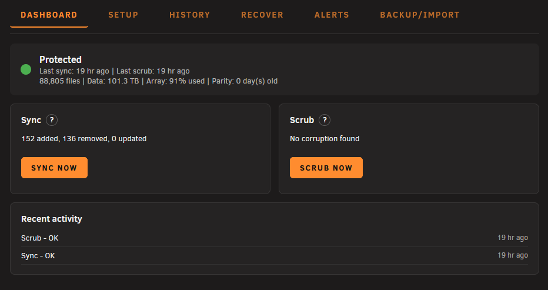

# SnapUnraid

A friendly webGUI front-end for [SnapRAID](https://www.snapraid.it/) on Unraid. It installs a prebuilt SnapRAID binary (no compiler required) and adds a **Settings → User Utilities** page for snapshot-based parity and protection.



## Features

- **Dashboard** — at-a-glance array status, parity freshness, live sync/scrub progress with ETA, and recent activity.
- **Setup** — pick a dedicated parity disk (plus an optional second parity disk), the data disks to protect, excludes, a schedule, and a deletion-safety threshold.
- **Recover** — list damaged files from the last scrub/check, restore a single file, a whole disk, or everything from parity, and run a full check on demand.
- **History** — past sync/scrub runs with full logs.
- **Alerts** — toggleable run notifications and proactive health alerts (parity stale, disk offline, low space, scrub overdue) delivered through Unraid's native notification system.
- **Backup/Import** — snapshot `snapraid.conf` + `settings.ini` to the flash drive, or import an existing `snapraid.conf` to pre-fill Setup.

## Install

In the Unraid webGUI, go to **Plugins → Install Plugin** and paste:

```
https://raw.githubusercontent.com/jwaspi/snapunraid/main/snapunraid.plg
```

Or install from the command line:

```bash
wget -O /tmp/snapunraid.plg https://raw.githubusercontent.com/jwaspi/snapunraid/main/snapunraid.plg
installplg /tmp/snapunraid.plg
```

## Quick start

1. **Setup** — choose a parity disk (a mounted disk at least as large as your largest data disk; raw `/dev/...` devices aren't supported — format the disk and add it as a pool first). Check the data disks to protect, then **Save Setup**.
2. **Dashboard → Sync Now** — the first sync builds parity across your data disks. It can take a while on a large array.
3. **Scrub** periodically to detect bit-rot and silent corruption. A schedule (e.g. nightly sync + weekly scrub) can be set in Setup.

## Schedule

The schedule is a cron-based picker:

- **Presets** — nightly sync + weekly scrub, Mon/Wed/Fri sync + Sunday scrub, weekly, or manual.
- **Custom** — day-of-week checkboxes and a time picker for sync and scrub (with an "Advanced" mode for raw cron expressions).
- A daily 3:15am health check always runs (parity stale, disk offline, low space, scrub overdue).

## Building from source

The `.plg` is self-contained — every file is embedded as an `<INLINE>` block and extracted to its absolute path on install. The editable sources live in `source/usr/local/emhttp/plugins/snapunraid/`, mirroring the install paths.

```bash
# regenerate snapunraid.plg from source/
php build/sync_plg.php

# verify snapunraid.plg matches source/
php build/verify_plg.php
```

## Notes

- SnapRAID snapshots your data disks and stores parity separately — it does not mirror files like an md parity array.
- A dedicated parity disk around the size of your largest data disk is recommended.
- The initial sync builds parity across your chosen data disks; subsequent syncs are incremental.

## License

[GPL-3.0](LICENSE) — the same license as SnapRAID itself.
